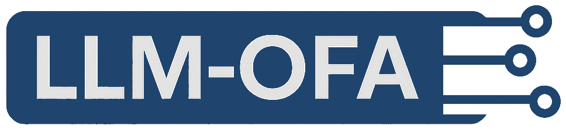

<p align="center">
  
</p>

# 🔗 Resources: LLM-OFA

Official links for the paper *“LLM-OFA: On-the-Fly Adaptation of Large Language Models to Address Temporal Drift Across Two Decades of News”* (CIKM 2025).

---

### 🧠 Code
**GitHub:** [github.com/PouyaGhahramanian/LLM-OFA](https://github.com/PouyaGhahramanian/LLM-OFA) (Implements OFA framework and the Adaptimizer optimizer.)

---

### 📰 Dataset
**1M-News (Kaggle):** [kaggle.com/datasets/pooyagh/one-million-news](https://www.kaggle.com/datasets/pooyagh/one-million-news) (1 million NYT headlines (2005–2025) for studying temporal drift.)

---

### 📄 Paper
**CIKM 2025 (ACM DOI):** [https://doi.org/10.1145/3746252.3760846](https://doi.org/10.1145/3746252.3760846)  

---

### 📚 Citation
```bibtex
@inproceedings{ghahramanian2025ofa,
  author    = {Pouya Ghahramanian and Sepehr Bakhshi and Fazli Can},
  title     = {LLM-OFA: On-the-Fly Adaptation of Large Language Models to Address Temporal Drift Across Two Decades of News},
  booktitle = {Proceedings of the 34th ACM International Conference on Information and Knowledge Management (CIKM '25)},
  year      = {2025},
  publisher = {ACM},
  doi       = {10.1145/3746252.3760846}
}
```
